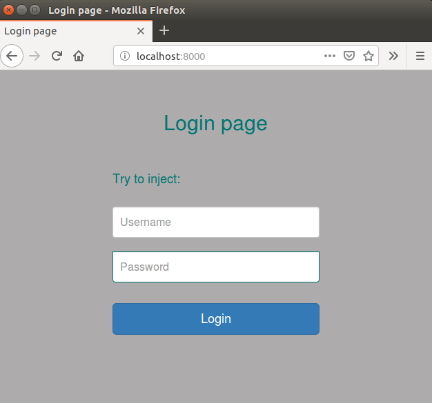

# NoSQL-injection-example
MongoDB injection example

# Installation

*sudo apt install npm nodejs*

*sudo apt-key adv --keyserver hkp://keyserver.ubuntu.com:80 --recv EA312927*

*echo "deb http://repo.mongodb.org/apt/ubuntu xenial/mongodb-org/3.2 multiverse" | sudo tee /etc/apt/sources.list.d/mongodb-org-3.2.list*

*sudo apt-get update*

*sudo apt-get install -y mongodb-org*

*sudo service mongod start*

*nodejs server.js*

# Example

